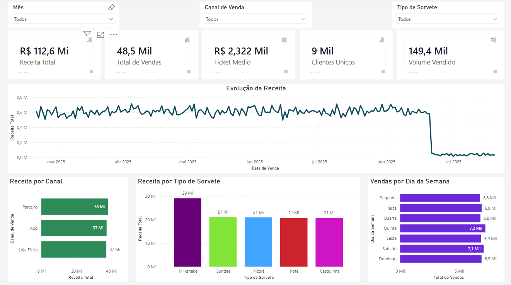
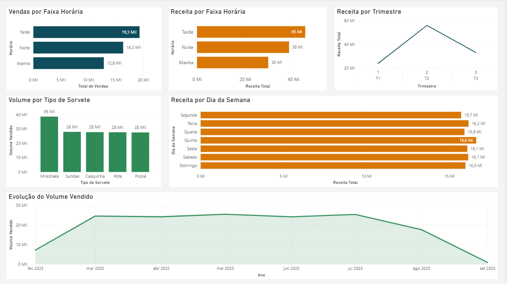

# Case Sorveteria Analytics

Case completo de BI com 50.000 registros, tratamento com Python, modelagem para Power BI, dashboard executivo/operacional e investigação de anomalia real na fonte de dados.

> Status: projeto finalizado, com base tratada, KPIs documentados, modelo dimensional, dashboard Power BI, apresentação do case e documentação técnica.

O registro formal da versão final está disponível em [`CHANGELOG.md`](CHANGELOG.md).

## Prévia do Dashboard

As capturas reais do dashboard Power BI estão disponíveis em `presentation/assets/` e foram integradas aos materiais da apresentação.



*Visão executiva do dashboard, com KPIs principais, evolução da receita e análises de apoio por canal, produto e dia da semana.*



*Visão operacional do dashboard, com foco em demanda, faixa horária, volume, trimestre e comportamento semanal.*

## Objetivo

Organizar uma base de vendas de sorvetes para apoiar uma jornada completa de analytics:

- entendimento do problema de negócio;
- análise exploratória dos dados;
- tratamento e validação da base;
- construção de indicadores de desempenho;
- modelagem dimensional para Power BI;
- desenvolvimento de dashboards executivo e operacional;
- documentação das descobertas, decisões técnicas e limitações dos dados.

## Pergunta De Negócio

Como a sorveteria pode aumentar receita a partir do comportamento de vendas de 2025, considerando produtos, sazonalidade, canais, regiões, mix de vendas e oportunidades operacionais?

## Estrutura Do Projeto

```text
case-sorveteria-analytics/
|-- assets/
|-- data/
|   |-- raw/
|   |-- interim/
|   |-- processed/
|   `-- powerbi/
|-- docs/
|-- exports/
|   |-- figures/
|   |-- tables/
|   `-- powerbi/
|-- notebooks/
|-- powerbi/
|   `-- dashboard_sorveteria.pbix
|-- presentation/
|-- scripts/
|-- .gitignore
|-- requirements.txt
|-- CHANGELOG.md
`-- README.md
```

## Descrição Das Pastas

- `data/raw`: dados originais, sem alteração. Arquivos desta pasta devem ser tratados como fonte imutável.
- `data/interim`: dados intermediários gerados durante limpeza, padronização e validação.
- `data/processed`: bases finais tratadas, prontas para análise, KPIs e Power BI.
- `data/powerbi`: modelo dimensional exportado para consumo no Power BI.
- `notebooks`: exploração, investigação de qualidade dos dados e protótipos analíticos.
- `scripts`: rotinas reutilizáveis para ingestão, limpeza, transformação e validação.
- `powerbi`: arquivo final do dashboard Power BI, apoio do modelo semântico, medidas DAX e documentação visual.
- `presentation`: materiais da apresentação executiva e storytelling final.
- `docs`: briefing, premissas, dicionário de dados, regras de negócio e documentos de referência.
- `exports`: tabelas, gráficos e artefatos finais exportados.
- `assets`: imagens, logos, ícones e recursos visuais.

## Dados De Entrada

Arquivo principal:

- `data/raw/vendas_sorvetes.csv`

Documento de referência:

- `docs/case_sorveteria.pptx`

Os arquivos originais não devem ser alterados. Qualquer transformação deve gerar novos arquivos em `data/interim` ou `data/processed`.

## Base Analítica Atual

Arquivo principal para análises e Power BI:

- `data/processed/vendas_sorvetes_tratado.csv`

Resumo da camada processada:

- 48.491 registros válidos;
- 31 colunas;
- 0 nulos finais;
- 0 duplicidades em `id_transacao`;
- `mes` e `hora` mantidos como nomes aprovados;
- principais campos de métricas: `receita_transacao`, `quantidade_vendida`, `valor_transacao` e `valor_unitario_medio`.

## Dashboard Power BI

O dashboard Power BI final foi ajustado manualmente no Power BI e está organizado em duas páginas: `Visao Executiva` e `Visao Operacional`. A documentação dos visuais, métricas, decisões de layout, cores e alterações manuais está em [`docs/dashboard_powerbi.md`](docs/dashboard_powerbi.md).

Durante a validação foi identificada uma redução abrupta de registros a partir de 22/08/2025. A investigação confirmou que a queda já existia no dataset bruto original e não foi causada por limpeza, transformação, modelagem ou construção do dashboard. Por isso, nenhum valor foi imputado artificialmente; a limitação e seu impacto nos indicadores temporais estão documentados em [`docs/dashboard_powerbi.md`](docs/dashboard_powerbi.md#limitacao-identificada-na-base-de-dados).

## Apresentação Do Case

Os materiais da apresentação executiva estão centralizados em `presentation/`, incluindo a estrutura narrativa, recomendações de negócio, capturas reais do dashboard e a versão Markdown/Marp do case em [`presentation/apresentacao_case_sorveteria.md`](presentation/apresentacao_case_sorveteria.md).

## Ambiente

Criar e ativar o ambiente virtual no Windows:

```powershell
python -m venv .venv
.\.venv\Scripts\Activate.ps1
pip install -r requirements.txt
```

Principais bibliotecas:

- `pandas`
- `numpy`
- `matplotlib`
- `jupyter`
- `openpyxl`

## Fluxo De Trabalho Executado

1. Registro de premissas e contexto do case em `docs/`.
2. Exploração inicial da base bruta em `notebooks/`.
3. Avaliação de estrutura, tipos de dados, nulos, duplicidades e consistência.
4. Tratamento e auditoria de registros em `data/interim`.
5. Geração da base tratada em `data/processed`.
6. Criação da camada dimensional em `data/powerbi`.
7. Definição e documentação dos KPIs executivos.
8. Construção do dashboard Power BI com visão executiva e operacional.
9. Investigação e documentação da anomalia de registros após 22/08/2025.
10. Criação da apresentação do case para portfólio e entrevistas.

## KPIs Entregues

Os principais indicadores entregues no dashboard e na documentação são:

- receita total;
- total de vendas;
- ticket médio;
- clientes únicos;
- volume vendido;
- receita por canal;
- receita por tipo de sorvete;
- vendas por dia da semana;
- receita por faixa horária;
- receita por trimestre;
- evolução do volume vendido.

## Regras De Governança

- Não editar arquivos em `data/raw`.
- Documentar premissas antes de aplicar transformações relevantes.
- Separar dados brutos, intermediários e processados.
- Manter notebooks numerados por etapa.
- Transformações recorrentes devem migrar de notebooks para `scripts`.
- Exportações finais devem ficar em `exports`.

## Evoluções Futuras

- Carregar a base tratada em um banco SQL.
- Automatizar o pipeline de atualização.
- Criar testes automatizados de qualidade dos dados.
- Publicar o relatório no Power BI Service.
- Adicionar alertas para anomalias de volume de registros.
- Evoluir análises preditivas de demanda.
