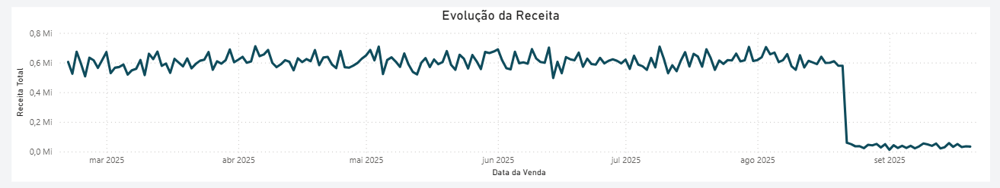
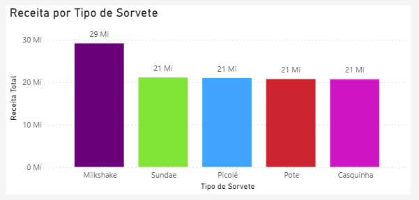

# Apresentação Executiva

Pasta para materiais de storytelling e apresentação final do Case Sorveteria Analytics.

## Arquivos

- `estrutura_narrativa.md`: roteiro narrativo da apresentação, organizado como história de negócio antes da criação dos slides.
- `apresentacao_case_sorveteria.md`: apresentação em Markdown/Marp para portfólio e entrevistas de BI/Analytics.
- `recomendacoes_negocio.md`: recomendações de negócio conectadas as evidências documentadas no projeto.
- `checklist_capturas_graficos.md`: lista de capturas reais que devem ser exportadas manualmente do Power BI.
- `assets/`: pasta destinada as capturas reais dos dashboards e gráficos usados na apresentação.

## Status dos entregáveis

- Estrutura narrativa: concluído.
- Slides finais: concluído em formato Markdown/Marp, alinhado ao roteiro narrativo consolidado.
- Recomendacoes de negócio: concluído.
- Gráficos exportados: concluído.

# Capturas do Dashboard

## Dashboard Executivo

Painel principal para leitura rápida da saúde do negócio, com KPIs executivos, evolução da receita e visuais de apoio por canal, produto e dia da semana.

## Dashboard Operacional

Painel voltado para rotina de operação, demanda, faixa horária, trimestre, volume vendido e comportamento semanal.

## Receita ao Longo do Tempo

Visual usado para acompanhar a evolução temporal da receita e apoiar a leitura da anomalia identificada após 22/08/2025.

## Top Produtos

Ranking de produtos usado para evidenciar a relevância da categoria Milkshake e dos principais sabores na composição da receita.
